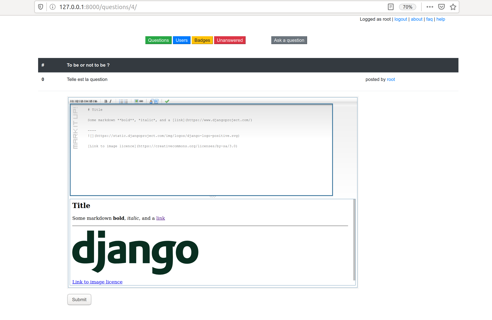

# Calcoverflow

## Summary

A simple, ugly and incomplete questions/answers platform :sweat_smile:

It's a **2012 experiment**, moved from gitlab and upgraded to **python 3**, **django 3** and **bootstrap** (not finished).

__Some features :__
- Write questions or answers in markdown format
- Preview your content with simple but nice markitup editor
- List recent questions, unanswered questions and users.
- Login/logout
- Admin panel (thanks to django admin)
- Design migrated to bootstrap (WIP)

## Setup env

```bash
# Setup python3 and deps
apt-get install python3-venv
apt-get install python3-pip # Probably not needed because venv could probably do it for us (?)
apt-get install python3-pymysql
apt-get install python3-mysqldb

# Virtual env
python3 -m venv ~/DjangoLatest
source ~/DjangoLatest/bin/activate
```

### Install deps

```bash
# Requirements
pip install Django
pip install django_registraton
pip install pymysql
pip install markdown
pip install wheel
pip install mysqlclient

# Install DB 
sudo apt-get install default-libmysqlclient-dev libmysqlclient-dev libmysqlclient20 python-mysqldb
```

Eventually edit `~/DjangoLatest/lib/python3.6/site-packages/django_registration/validators.py` to change 
`from django.utils import six` to `import six`

### Prepare db 

```bash
su 
mysql -u root -p
(Do not type anything)
ALTER USER 'tib'@'localhost' IDENTIFIED BY 'pass';
FLUSH PRIVILEGES;
python manage.py migrate
python manage.py createsuperuser
```

### Run

```bash
# Start service
python manage runserver
```

## Screenies



